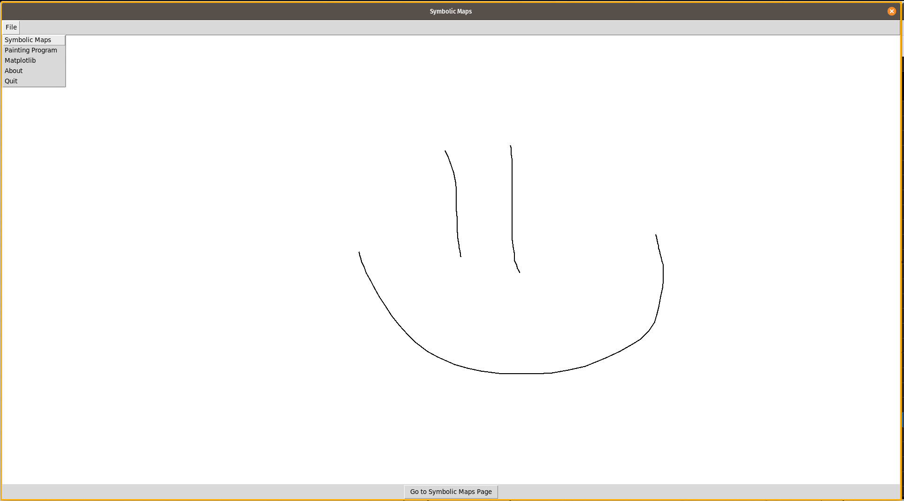

# geomlab2020

Code for the geomlab.



# Installation

  To get this running you need to have:
  - poetry - a python package manager
  - pyenv - manages multiple python versions without messing with the host python version 💚
  - Some kind of Python 3.7 (e.g., `$ pyenv install 3.7.5`)
  installed.

  Then simply run:

  ```bash
  $ poetry install
  ```

  let it install all deps and then

  ```bash
  $ poetry shell
  ```

  To test if everything got installed correctly you can do the following:

  ```shell
  $ python
  Python 3.7.5 (default, May 23 2020, 15:44:44) 
  [GCC 9.3.0] on linux
  Type "help", "copyright", "credits" or "license" for more information.
  >>> import geomlab
  >>> geomlab.__version__
  '0.1.0'
  ```

  will create a virtual environment for you with everything working out
  smoothly and no interference with the host. If you guys need help with
  integration, feel free to drop anything into slack. As always, I'm most
  likely to respond on `WEEKDAY not in (Wed,Thu,Fri)`, YouRS.

# TODOs

  - [X] GUI
  - [ ] Transfer covid-19 dataset here
  - [ ] Help Philipp transfer his project here
  - [ ] Probability Distributions
